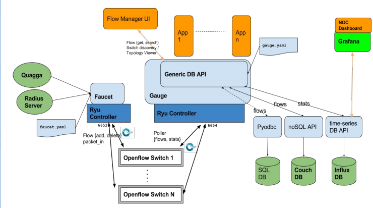

# Experimento con Faucet ##

## Pasos previos ##

1. Configurar prometheus para que permita el monitoreo de contenedores con cAdvisor (tengase en cuenta que la IP de la interfaz de red para este caso fue **wlp2s0 = 192.168.1.3**):

```yml
# my global config
global:
  scrape_interval:     15s # Set the scrape interval to every 15 seconds. Default is every 1 minute.
  evaluation_interval: 15s # Evaluate rules every 15 seconds. The default is every 1 minute.
  # scrape_timeout is set to the global default (10s).

# Load rules once and periodically evaluate them according to the global 'evaluation_interval'.
rule_files:
  - "faucet.rules.yml"

# A scrape configuration containing exactly one endpoint to scrape:
# Here it's Prometheus itself.
scrape_configs:
  # The job name is added as a label `job=<job_name>` to any timeseries scraped from this config.
  - job_name: 'prometheus'
    static_configs:
      - targets: ['192.168.1.3:9090']
  - job_name: 'faucet'
    static_configs:
      - targets: ['192.168.1.3:9302']
  - job_name: 'gauge'
    static_configs:
      - targets: ['192.168.1.3:9303']
  - job_name: 'cadvisor'
    static_configs:
      - targets: ['192.168.1.3:8080']
```

**Pendiente**: Usar una variable de entorno de manera que se pueda obtener la IP de manera automatica sin editar manualmente cada vez que se cambia la dirección IP de la interfaz de red.

2. Reiniciar prometheus para que los cambios anteriores tengan efecto:

```bash
sudo systemctl restart prometheus
```

3. Arranque cAdvisor tal y como se encuentra en la [pagina](https://github.com/google/cadvisor).

```bash
sudo docker run \
  --volume=/:/rootfs:ro \
  --volume=/var/run:/var/run:ro \
  --volume=/sys:/sys:ro \
  --volume=/var/lib/docker/:/var/lib/docker:ro \
  --volume=/dev/disk/:/dev/disk:ro \
  --publish=8080:8080 \
  --detach=true \
  --name=cadvisor \
  google/cadvisor:latest
```

## Pasos con Faucet##

1. Definir la topologia ([topologia-test.py](topologia-test.py)) y ponerla a funcionar. 

```bash
sudo python topologia-test.py
```

2. Verificar las caracteristicas del switch creado:

```bash
# Comando aplicado
sudo sudo ovs-vsctl show
# Salida para el caso
9ec06414-9bd9-4579-81d4-8e7801c2eb61
    Bridge "s1"
        Controller "tcp:127.0.0.1:6654"
        Controller "tcp:127.0.0.1:6653"
        fail_mode: secure
        Port "s1-eth2"
            Interface "s1-eth2"
        Port "s1-eth3"
            Interface "s1-eth3"
        Port "s1"
            Interface "s1"
                type: internal
        Port "s1-eth1"
            Interface "s1-eth1"
    ovs_version: "2.5.5"
```

3. El controlador que se empleará sera el faucet cuya arquitectura se muestra a continuación. 



Para trabajar con este controlador se llevan a cabo las siguientes tareas:
* Editar el archivo de configuracion del faucet (**/etc/faucet/faucet.yaml**). Para nuestro caso quedo así:

```yaml
---
version: 2
vlans:
    test_network:
        vid: 100
        description: "Red de prueba"

dps:
    s1:
        dp_id: 0x0000000000000001
        hardware: "Open vSwitch"
        interfaces:
            1:
                name: "h1"
                description: "atacante"
                native_vlan: test_network
            2:
                name: "h2"
                description: "cliente"
                native_vlan: test_network
            3:
                name: "h3"
                description: "servidor"
                native_vlan: test_network
```

4. Chequear el archivo de configuración de faucet:

```bash
check_faucet_config /etc/faucet/faucet.yaml
```

5. Iniciar faucet:

```bash
sudo faucet -v --ryu-app simple_switch_13.py
```

5. Iniciar gauge:

```bash
sudo gauge -v 
```


