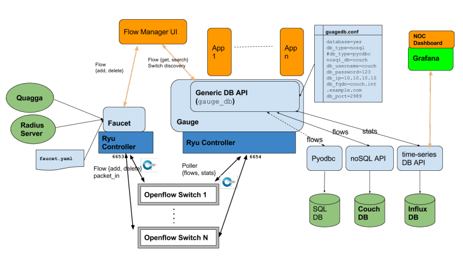
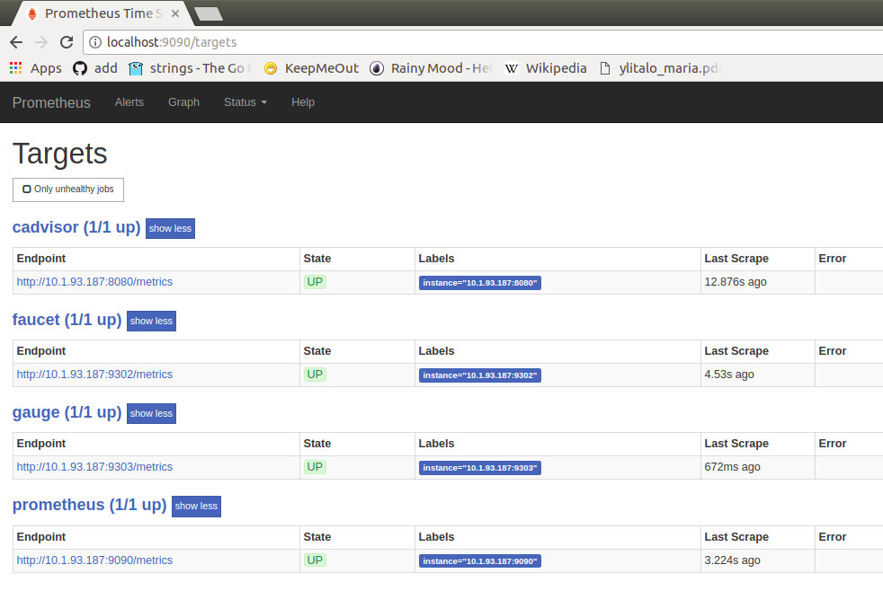
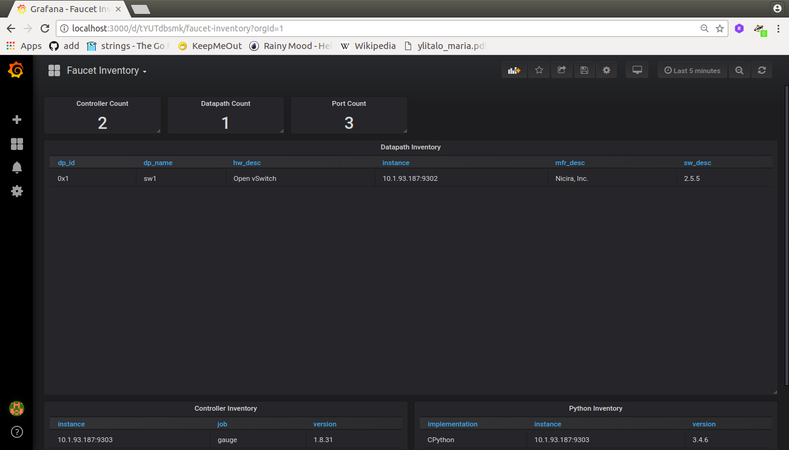
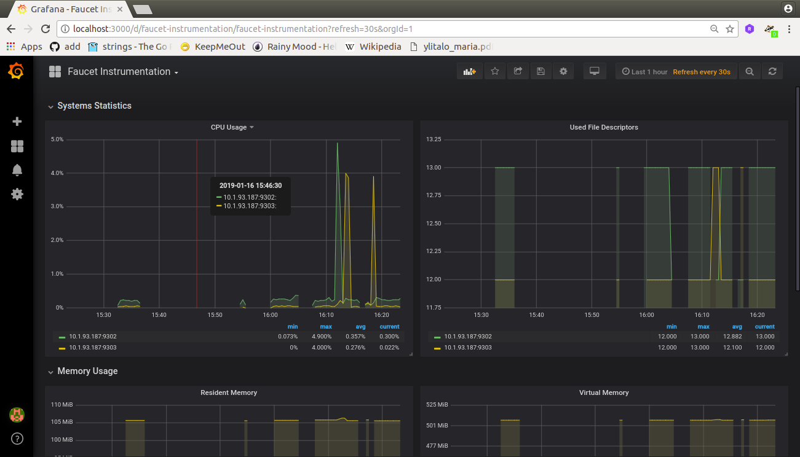
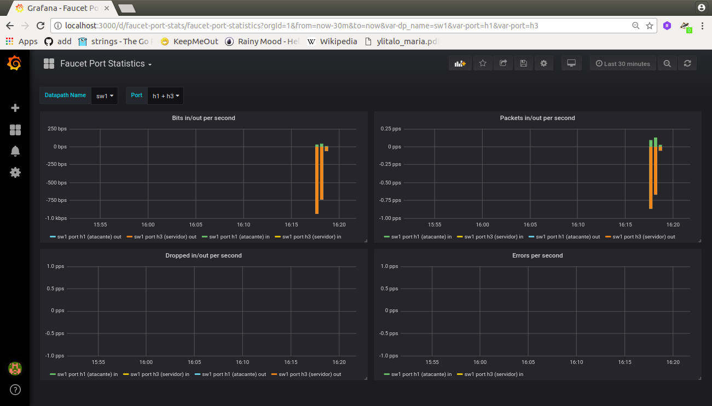
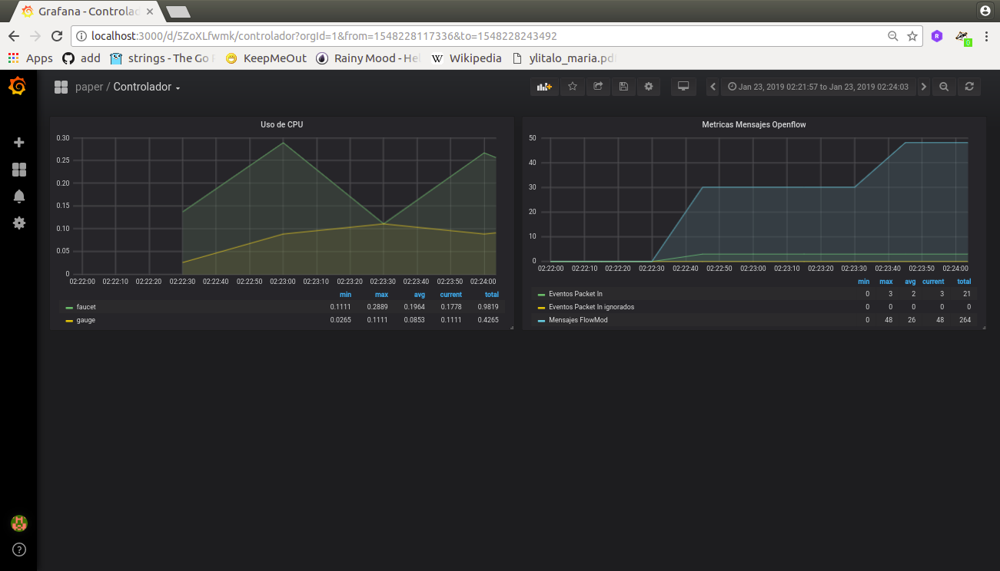
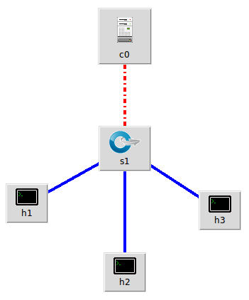
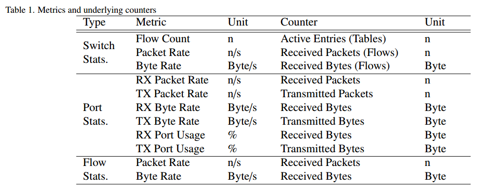

# Reporte 1 #

* **Fecha**: 25/01/2019

## Controlador Faucet ##

### Arquitectura ###

Faucet es un controlador Openflow que permite a los operadores de red correr sus redes de la misma manera como lo hacen en clusters de servidores y por lo tanto esta concebido para el desarrollo de aplicaciones de red. El la siguiente figura se muestra la arquitectura de faucet:



Teniendo en cuenta la figura anterior, y desde el punto se vista mas basico, Faucet tiene los siguientes componentes:
1. **Ryu**: Controlador Openflow en el cual se basa el faucet.
   1. **Faucet**: Parte que implementa las funciones de red, por ejemplo las aplicaciones de envio de paquetes (switching application). 
   2. **Gauge**: Aplicacion Ryu para el monitoreo y obtencion de estadisticas.
2. **time-series DB (Base de datos de series de tiempo)**
   1. **Opcion 1**: InfluxDB
   2. **Opcion 2** Prometheus.

En la siguiente figura se muestra prometheus, al cual se accede usando la URL: **http://localhost:9090**



3. **Grafana (Dashboard)**: Paneles de usuario. Estos paneles se pueden hacer en el mismo Grafana o instalarlos mediante el archivo de descripción JSON (que describe el panel) y que es compartido por otros. Para el caso los siguientes paneles, se obtubieron del siguiente [enlace](https://docs.faucet.nz/en/latest/tutorials/first_time.html). Para acceder a los paneles de grafana se emplea la siguiente URL: **http://localhost:3000**. A continuación se muestra cada una de los paneles:

**[Inventario](https://docs.faucet.nz/en/latest/_static/grafana-dashboards/faucet_inventory.json)**

 

**[Instrumentacion](https://docs.faucet.nz/en/latest/_static/grafana-dashboards/faucet_instrumentation.json)**



**[Estadisticas de puertos](https://docs.faucet.nz/en/latest/_static/grafana-dashboards/faucet_port_statistics.json)**




Con el fin de contar mensajes entre el controlador y el switch se creo una nueva dashboard la cual se muestra a continuacion:




### Utilidad ###

Para nuestro caso, la mayor motivación en la elección fue la facilidad (que al parecer por el momento) ofrece este controlador en el desarrollo de aplicaciones. Esto se puede ver en atributos como: capacidad de ejecución en entornos virtuales y reales, open source que permite agregar nuevas caracteristicas, facilidad de debugging, facil administracion, etc.


## Experimento con Faucet ##

### Topologia ###

La siguiente figura muestra la topologia de test donde **h1** sera el atacante, **h2** sera el cliente y **h3** sera el servidor.



El [script](topologia-test.py) que describe la topologia es:

```python
from mininet.node import OVSSwitch, Controller, RemoteController
from mininet.cli import CLI
from mininet.net import Containernet
from mininet.log import info, setLogLevel
import time

import os

setLogLevel('info')

info('*** Create the controller \n')

#info(c0)
"Create Simple topology example."
net = Containernet(switch = OVSSwitch, build=False)
net.addController('c0', controller = RemoteController, ip = "127.0.0.1", port = 6653)
net.addController('c1', controller = RemoteController, ip = "127.0.0.1", port = 6654)
# Initialize topology

# Add containers
h1 = net.addHost('h1', ip='10.0.0.251')  # Cliente
h2 = net.addHost('h2', ip='10.0.0.252')  # Atacante
h3 = net.addHost('h3', ip='10.0.0.253')  # Victima

# Add switches    
info('*** Adding switches\n')
sw1 = net.addSwitch('sw1', protocols='OpenFlow13')

# Add links    
info('*** Creating links\n')
net.addLink( h1, sw1 )
net.addLink( h2, sw1 )
net.addLink( h3, sw1 )

# Build the network
info('*** Build the network\n')
net.build()

info('*** Starting network\n')
net.start()

info('*** Running CLI\n')
CLI(net)

info('*** Stopping network')
net.stop()
```

### Pasos del experimento ###

A continuación se describen los pasos mas basicos para llevar a cabo el experimento:
1. Arrancar el faucet.

```bash
# Arrancando el bash del contenedor faucet
sudo docker run -it \
    --name faucet \
    --restart=always \
    -v /etc/faucet/:/etc/faucet/ \
    -v /var/log/faucet/:/var/log/faucet/ \
    -p 6653:6653 \
    -p 9302:9302 \
    -p 8080:8080 \
    faucet/faucet \
    bash

# Ejecutando faucet con la aplicacion ofctl_rest para hacer consultas restful
find / -name ofctl_rest.py
cd /usr/lib/python3.6/site-packages/ryu/app 
faucet -v --ryu-app ofctl_rest.py
```

2. Arrancar el gauge.

```bash
# Arrancando el basf el contenedor gauge
sudo docker run -it \
    --name gauge \
    --restart=always \
    -v /etc/faucet/:/etc/faucet/ \
    -v /var/log/faucet/:/var/log/faucet/ \
    -p 6654:6653 \
    -p 9303:9303 \
    faucet/gauge \
    bash

# Ejecutando el gauge
gauge -v
```
3. Verificar en el prometheus que los targets este listos. Para ello se da la URL: http://localhost:9090/targets

4. Mirar los resultados en grafana. Para lo cual se mira los dasboards disponibles en http://localhost:3000

5. Arrancar mininet

```bash
sudo python topologia-test.py 
```

## Algunas consultas hechas por el RESTUL API ##

Para esto se cargo la aplicacion [ofctl_rest.py](https://github.com/osrg/ryu/blob/master/ryu/app/ofctl_rest.py), cuyo uso se muestra en el siguiente enlace [ryu.app.ofctl_rest](https://ryu.readthedocs.io/en/latest/app/ofctl_rest.html#retrieve-the-switch-stats). De todas las estadisticas posibles se hizo enfasis en:
1. [Get aggregate flow stats](https://ryu.readthedocs.io/en/latest/app/ofctl_rest.html#get-aggregate-flow-stats):

```
curl -X GET http://localhost:8080/stats/aggregateflow/<dpid>
```

2. [Get ports stats](https://ryu.readthedocs.io/en/latest/app/ofctl_rest.html#get-ports-stats)

```
curl -X GET http://localhost:8080/stats/port/<dpid>[/<port>]
```

3. Lectura del los flujos programados en el switch:

```bash
sudo ovs-ofctl dump-flows SWITCH --protocols=OpenFlow13
```


4. Lectura de las estadisticas de los puertos desde consola:

```bash
sudo ovs-ofctl dump-ports SWITCH --protocols=OpenFlow13
```

### Algunas pruebas ###

Se toman las medidas anteriores antes y despues de la ejecución de los comandos citasos a continuación.

1. Prueba de conectividad: 

```bash
# Terminal mininet
pingall
```

No se obtuvieron nada de observaciones relevantes.


2. Prueba de ping fijo: 

```bash
# Terminal mininet
h1 ping -c 200 -i 0.5 h3
```

No se obtuvieron nada de observaciones relevantes.

3. Prueba iperf. [Enlace util](https://support.cumulusnetworks.com/hc/en-us/articles/216509388-Throughput-Testing-and-Troubleshooting):

```bash
# Terminal mininet
iperf
```

No se obtuvieron nada de observaciones relevantes.

4. Prueba iperf distintas terminales. 


**Servidor iperf (h3)**:

```bash
# Terminal h3
iperf3 -s -p 5003
```

No se obtuvieron nada de observaciones relevantes.

**Cliente iperf (h1)**:


```bash
# Terminal h1
iperf3 -c 10.0.0.253 -p 5003 -i 0.5 -t 200 
```

No se obtuvieron nada de observaciones relevantes.

4. Prueba con el ataque:

**Caso 1**: Sin el iperf


```bash
# Terminal h1 (atacante)
hping3 --flood --rand-source 10.0.0.253
```


Opcionalmente, con el fin de ver si se ve comprometida la conectividad, se puede hacer unos cuantos pings entre el cliente y el servidor.

En la prueba anterior, parece que el controlador tiene resistencia a los ataques por inundacion pues el controller no se satura para nada. y la prueba de ping se hace con exito.

```bash
# Terminal mininet ()
h1 ping -c 100 -i 0.5 h3
```

**Caso 2**: Con el iperf


```bash
# Terminal h3 (servidor iperf)
iperf3 -s -p 5003
```


```bash
# Terminal h2 (cliente iperf)
iperf3 -c 10.0.0.253 -p 5003 -i 0.5 -t 200 
```


```bash
# Terminal h1 (atacante)
hping3 --flood --rand-source 10.0.0.253
```

En medio del ataque se hicieron pruebas de conectividad con ping. El funcionamiento no se afecto para nada.

En medio de la prueba se hizo pingall.

```bash
containernet> pingall
*** Ping: testing ping reachability
h1 -> h2 h3 
h2 -> h1 h3 
h3 -> h1 h2 
*** Results: 0% dropped (6/6 received)
```

Para el caso dado, se pudo evidenciar que el archivo faucet.yml hace que se instalen unos flujos iniciales en el controlador:

```bash
# Comando
sudo ovs-ofctl dump-flows sw1 --protocols=OpenFlow13

# Resultados
OFPST_FLOW reply (OF1.3) (xid=0x2):
 cookie=0x5adc15c0, duration=4.268s, table=0, n_packets=5, n_bytes=426, priority=9000,in_port=1,vlan_tci=0x0000/0x1fff actions=push_vlan:0x8100,set_field:4196->vlan_vid,goto_table:1
 cookie=0x5adc15c0, duration=4.268s, table=0, n_packets=5, n_bytes=426, priority=9000,in_port=2,vlan_tci=0x0000/0x1fff actions=push_vlan:0x8100,set_field:4196->vlan_vid,goto_table:1
 cookie=0x5adc15c0, duration=4.268s, table=0, n_packets=5, n_bytes=426, priority=9000,in_port=3,vlan_tci=0x0000/0x1fff actions=push_vlan:0x8100,set_field:4196->vlan_vid,goto_table:1
 cookie=0x5adc15c0, duration=4.267s, table=0, n_packets=0, n_bytes=0, priority=0 actions=drop
 cookie=0x5adc15c0, duration=4.268s, table=1, n_packets=0, n_bytes=0, priority=20490,dl_type=0x9000 actions=drop
 cookie=0x5adc15c0, duration=4.268s, table=1, n_packets=0, n_bytes=0, priority=20480,dl_src=ff:ff:ff:ff:ff:ff actions=drop
 cookie=0x5adc15c0, duration=4.268s, table=1, n_packets=0, n_bytes=0, priority=20480,dl_src=0e:00:00:00:00:01 actions=drop
 cookie=0x5adc15c0, duration=3.769s, table=1, n_packets=4, n_bytes=340, hard_timeout=285, priority=8191,in_port=3,dl_vlan=100,dl_src=ee:02:63:97:65:6d actions=goto_table:2
 cookie=0x5adc15c0, duration=3.479s, table=1, n_packets=4, n_bytes=340, hard_timeout=275, priority=8191,in_port=1,dl_vlan=100,dl_src=fa:51:ee:62:44:dd actions=goto_table:2
 cookie=0x5adc15c0, duration=3.418s, table=1, n_packets=3, n_bytes=250, hard_timeout=275, priority=8191,in_port=2,dl_vlan=100,dl_src=b6:08:43:c4:b0:dc actions=goto_table:2
 cookie=0x5adc15c0, duration=4.267s, table=1, n_packets=4, n_bytes=348, priority=4096,dl_vlan=100 actions=CONTROLLER:96,goto_table:2
 cookie=0x5adc15c0, duration=4.267s, table=1, n_packets=0, n_bytes=0, priority=0 actions=goto_table:2
 cookie=0x5adc15c0, duration=3.769s, table=2, n_packets=0, n_bytes=0, idle_timeout=435, priority=8192,dl_vlan=100,dl_dst=ee:02:63:97:65:6d actions=pop_vlan,output:3
 cookie=0x5adc15c0, duration=3.479s, table=2, n_packets=0, n_bytes=0, idle_timeout=425, priority=8192,dl_vlan=100,dl_dst=fa:51:ee:62:44:dd actions=pop_vlan,output:1
 cookie=0x5adc15c0, duration=3.418s, table=2, n_packets=0, n_bytes=0, idle_timeout=425, priority=8192,dl_vlan=100,dl_dst=b6:08:43:c4:b0:dc actions=pop_vlan,output:2
 cookie=0x5adc15c0, duration=4.267s, table=2, n_packets=15, n_bytes=1278, priority=0 actions=goto_table:3
 cookie=0x5adc15c0, duration=4.268s, table=3, n_packets=0, n_bytes=0, priority=8240,dl_dst=01:00:0c:cc:cc:cd actions=drop
 cookie=0x5adc15c0, duration=4.268s, table=3, n_packets=0, n_bytes=0, priority=8240,dl_vlan=100,dl_dst=ff:ff:ff:ff:ff:ff actions=pop_vlan,output:1,output:2,output:3
 cookie=0x5adc15c0, duration=4.268s, table=3, n_packets=0, n_bytes=0, priority=8236,dl_dst=01:80:c2:00:00:00/ff:ff:ff:ff:ff:f0 actions=drop
 cookie=0x5adc15c0, duration=4.267s, table=3, n_packets=0, n_bytes=0, priority=8216,dl_vlan=100,dl_dst=01:80:c2:00:00:00/ff:ff:ff:00:00:00 actions=pop_vlan,output:1,output:2,output:3
 cookie=0x5adc15c0, duration=4.267s, table=3, n_packets=0, n_bytes=0, priority=8216,dl_vlan=100,dl_dst=01:00:5e:00:00:00/ff:ff:ff:00:00:00 actions=pop_vlan,output:1,output:2,output:3
 cookie=0x5adc15c0, duration=4.267s, table=3, n_packets=15, n_bytes=1278, priority=8208,dl_vlan=100,dl_dst=33:33:00:00:00:00/ff:ff:00:00:00:00 actions=pop_vlan,output:1,output:2,output:3
 cookie=0x5adc15c0, duration=4.267s, table=3, n_packets=0, n_bytes=0, priority=8192,dl_vlan=100 actions=pop_vlan,output:1,output:2,output:3
 cookie=0x5adc15c0, duration=4.267s, table=3, n_packets=0, n_bytes=0, priority=0 actions=drop
```

Cabe anotar que a lo largo de las pruebas la tabla de flujos no cambia.


## Experimento con el controlador Ryu ##

Para el caso dado, se procedio a ejecutar en un controlador ryu las aplicaciones simple_switch_13.py y ofctl_rest.py. A contrinuacion se muestran los comandos para ello:


```bash
# Terminal mininet
sudo mn --topo single,3 --mac --controller remote --switch ovsk,protocols=OpenFlow13
ovs-vsctl set bridge s1 protocols=OpenFlow13
```

```bash
# Terminal controlador ryu
ryu-manager --verbose simple_switch_13.py ofctl_rest.py
```

Para el caso, inicialmente la tabla de flujos para el ryu solo tiene la siguiente regla:

```bash
# Comando
sudo ovs-ofctl dump-flows s1 --protocols=OpenFlow13
# Resultado
OFPST_FLOW reply (OF1.3) (xid=0x2):
 cookie=0x0, duration=21.127s, table=0, n_packets=21, n_bytes=1758, priority=0 actions=CONTROLLER:65535
```

Despues de ejecutar un pingall, el controlador aprende todas las reglas quedando estas asi:

```bash
# Comando
sudo ovs-ofctl dump-flows s1 --protocols=OpenFlow13
# Resultado
OFPST_FLOW reply (OF1.3) (xid=0x2):
 cookie=0x0, duration=17.598s, table=0, n_packets=4, n_bytes=280, priority=1,in_port=2,dl_src=00:00:00:00:00:02,dl_dst=00:00:00:00:00:01 actions=output:1
 cookie=0x0, duration=17.596s, table=0, n_packets=3, n_bytes=238, priority=1,in_port=1,dl_src=00:00:00:00:00:01,dl_dst=00:00:00:00:00:02 actions=output:2
 cookie=0x0, duration=17.589s, table=0, n_packets=4, n_bytes=280, priority=1,in_port=3,dl_src=00:00:00:00:00:03,dl_dst=00:00:00:00:00:01 actions=output:1
 cookie=0x0, duration=17.588s, table=0, n_packets=3, n_bytes=238, priority=1,in_port=1,dl_src=00:00:00:00:00:01,dl_dst=00:00:00:00:00:03 actions=output:3
 cookie=0x0, duration=17.583s, table=0, n_packets=4, n_bytes=280, priority=1,in_port=3,dl_src=00:00:00:00:00:03,dl_dst=00:00:00:00:00:02 actions=output:2
 cookie=0x0, duration=17.582s, table=0, n_packets=3, n_bytes=238, priority=1,in_port=2,dl_src=00:00:00:00:00:02,dl_dst=00:00:00:00:00:03 actions=output:3
 cookie=0x0, duration=104.281s, table=0, n_packets=36, n_bytes=2724, priority=0 actions=CONTROLLER:65535
```


## Conclusiones ##

1. Un estudio mas a fondo sobre el faucet vale la pena. Al ser basado en ryu es muy probable que el background que se tiene hasta el momento no se pierda.
2. El desarrollo de aplicaciones desde este controlador puede ser llevado de tres maneras:
   * El desarrollo de una aplicación en el top de faucet que entregue a faucet un nuevo archivo de configuración y que pida a faucet que la aplique.
   * Modificar el codigo del controlador (Ryu en el caso) directamente para agregar una caracteristica deseada.
   * Agregar algun API conveniente a las necesidades del operador (por ejemplo, integrar el BroIDS).
   
   Por el momento la exploracion se llevo desde el archivo de configuración, el cual definiauna reglas para programar el switch en el arranque.
3. El monitoreo es enormemente facilitado en faucet.
4. Se hizo la prueba con ryu, y no se vio cambios significativos en el desempeño (s simple vista y sin un analisis profundo) por lo que este tipo de ataque por lo visto no presenta ningun efecto en el controlador, por lo menos desde el experimento realizado. Valdria la pena escalar la topologia y ver el efecto. 
5. Para e caso dado no se pudo ver el efecto en el host atacado.
6. Los siguientes enlaces sirven para pensar en la automatización de las pruebas: 
   * [DDoS - OpenState](https://github.com/OpenState-SDN/ryu/wiki/DDoS)
   * [ddos.py](https://github.com/OpenState-SDN/ryu/blob/master/ryu/app/openstate/test/ddos.py)
7. Cuando se ve el log de salida tanto del faucet, como de la aplicacion asociada al controlador ryu normalse puede ver la diferencia. A continuación se muestra cada log con fines de comparación:

Log de faucet:

```bash
...
EVENT Faucet->Faucet EventFaucetStateExpire
EVENT Faucet->Faucet EventFaucetMetricUpdate
EVENT Faucet->Faucet EventFaucetResolveGateways
EVENT Faucet->Faucet EventFaucetFastStateExpire
EVENT Faucet->Faucet EventFaucetFastAdvertise
EVENT Faucet->Faucet EventFaucetResolveGateways
EVENT Faucet->Faucet EventFaucetStateExpire
EVENT Faucet->Faucet EventFaucetFastStateExpire
10.1.93.187 - - [28/Jan/2019 23:51:52] "GET /metrics HTTP/1.1" 200 20720 0.004616
EVENT Faucet->Faucet EventFaucetMetricUpdate
EVENT Faucet->Faucet EventFaucetResolveGateways
EVENT Faucet->Faucet EventFaucetFastStateExpire
EVENT Faucet->Faucet EventFaucetResolveGateways
EVENT Faucet->Faucet EventFaucetFastAdvertise
EVENT Faucet->Faucet EventFaucetStateExpire
EVENT Faucet->Faucet EventFaucetAdvertise
EVENT Faucet->Faucet EventFaucetFastStateExpire
EVENT Faucet->Faucet EventFaucetResolveGateways
...
```

Log de ryu:

```bash
packet in 1 00:00:00:00:00:01 ff:ff:ff:ff:ff:ff 1
EVENT ofp_event->SimpleSwitch13 EventOFPPacketIn
packet in 1 00:00:00:00:00:01 ff:ff:ff:ff:ff:ff 1
EVENT ofp_event->SimpleSwitch13 EventOFPPacketIn
packet in 1 00:00:00:00:00:01 ff:ff:ff:ff:ff:ff 1
EVENT ofp_event->SimpleSwitch13 EventOFPPacketIn
packet in 1 00:00:00:00:00:01 ff:ff:ff:ff:ff:ff 1
EVENT ofp_event->SimpleSwitch13 EventOFPPacketIn
packet in 1 00:00:00:00:00:01 ff:ff:ff:ff:ff:ff 1
EVENT ofp_event->SimpleSwitch13 EventOFPPacketIn
packet in 1 00:00:00:00:00:01 ff:ff:ff:ff:ff:ff 1
EVENT ofp_event->SimpleSwitch13 EventOFPPacketIn
packet in 1 00:00:00:00:00:01 ff:ff:ff:ff:ff:ff 1
EVENT ofp_event->SimpleSwitch13 EventOFPPacketIn
packet in 1 00:00:00:00:00:01 ff:ff:ff:ff:ff:ff 1
(22545) accepted ('10.1.93.187', 49214)
10.1.93.187 - - [28/Jan/2019 17:44:16] "GET /metrics HTTP/1.1" 404 278 0.000597
EVENT ofp_event->SimpleSwitch13 EventOFPPacketIn
packet in 1 00:00:00:00:00:01 ff:ff:ff:ff:ff:ff 1
EVENT ofp_event->SimpleSwitch13 EventOFPPacketIn
packet in 1 00:00:00:00:00:01 ff:ff:ff:ff:ff:ff 1
EVENT ofp_event->SimpleSwitch13 EventOFPPacketIn
packet in 1 00:00:00:00:00:01 ff:ff:ff:ff:ff:ff 1
EVENT ofp_event->SimpleSwitch13 EventOFPPacketIn
packet in 1 00:00:00:00:00:01 ff:ff:ff:ff:ff:ff 1
EVENT ofp_event->SimpleSwitch13 EventOFPPacketIn
packet in 1 00:00:00:00:00:01 ff:ff:ff:ff:ff:ff 1
EVENT ofp_event->SimpleSwitch13 EventOFPPacketIn
packet in 1 00:00:00:00:00:01 ff:ff:ff:ff:ff:ff 1
EVENT ofp_event->SimpleSwitch13 EventOFPPacketIn
packet in 1 00:00:00:00:00:01 ff:ff:ff:ff:ff:ff 1
```

8. Para ver los efectos en lo que respecta al consumo de recursos de los host el siguiente [enlace](https://stackoverflow.com/questions/37644275/cpu-utilization-in-sdn-pox-controller) podria ser muy util.


##Dudas##

Aun tengo muchas dudas con el iperf entre estas:
1. ¿iperf mide el ancho de banda del canal en cuestion solamente libre o lo que hay en general?
2. ¿Esta prueba si tiene validez?
3. ¿Con que otra herramienta se puede emular trafico realista?

## Pendientes ##

1. Graficas para llevar a cabo el analisis.
2. Mirar la herramienta para producir trafico de red.
3. Cualquier otra sugerencia de los jefes.

## Desorden ##

Del articulo **SOFTmon - Traffic Monitoring for SDN** en la siguiente tabla se muestran algunas metricas




## Referencias ##


1. [Faucet Deploying SDN in the Enterprise](https://static.googleusercontent.com/media/research.google.com/en//pubs/archive/45641.pdf)
2. [Informacion Faucet](https://github.com/faucetsdn/faucet.nz)
3. [Faucet - The Open Source Production Quality OpenFlow Switch](https://wand.nz/~brad/talks/faucet.pdf)
4. [Faucet : Openflow SDN Made Easy](https://www.ausnog.net/sites/default/files/ausnog-2018/presentations/1.8_Richard_Nelson_AusNOG2018.pdf)
5. [Software defined networking - aarnet](https://www.gdt.id.au/~gdt/presentations/2016-07-05-questnet-sdn/2016-07-05-questnet-sdn-notes.pdf)
6. [github Inside Openflow](https://github.com/inside-openflow)
7. https://floodlight.atlassian.net/wiki/spaces/floodlightcontroller/pages/15040523/How+to+Use+OpenFlow+Meters
8. https://blog.sflow.com/2013/08/northbound-apis-for-traffic-engineering.html
9. https://blog.sflow.com/2013/05/software-defined-analytics.html
10. https://cse.buet.ac.bd/thesis_add/thesis_file/1205012.pdf
11. https://github.com/OpenState-SDN/ryu/wiki/DDoS
12. https://github.com/OpenState-SDN/ryu/blob/master/ryu/app/openstate/test/ddos.py
13. https://arxiv.org/pdf/1808.01177.pdf
14. https://blog.sflow.com/2018/10/ryu-measurement-based-control.html

