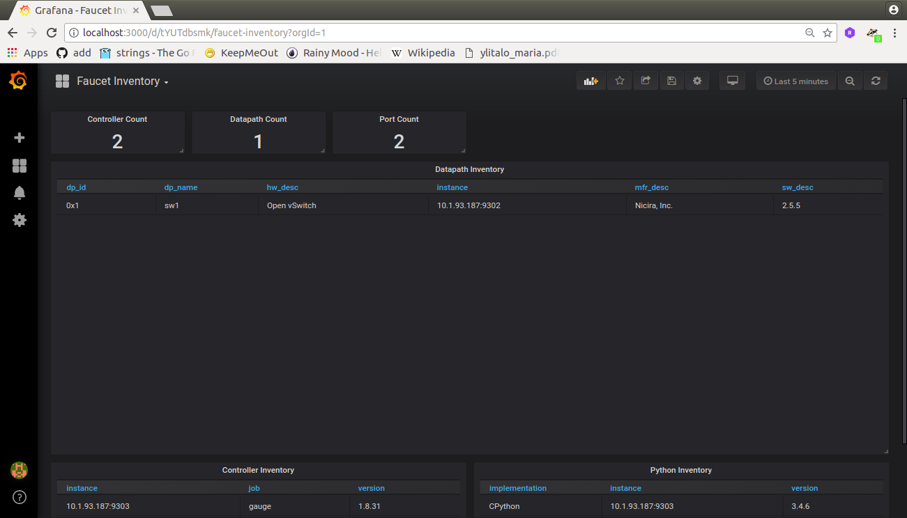
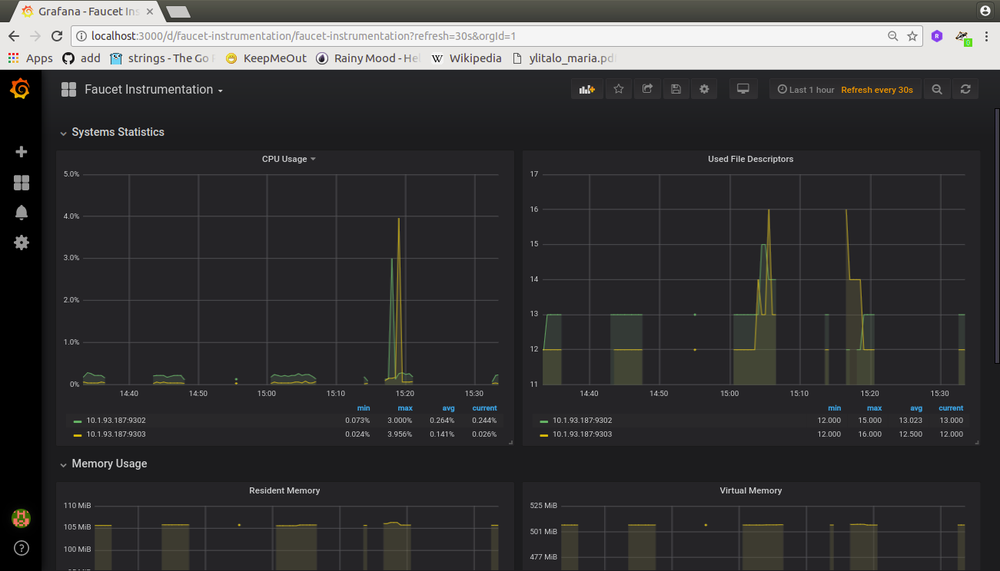
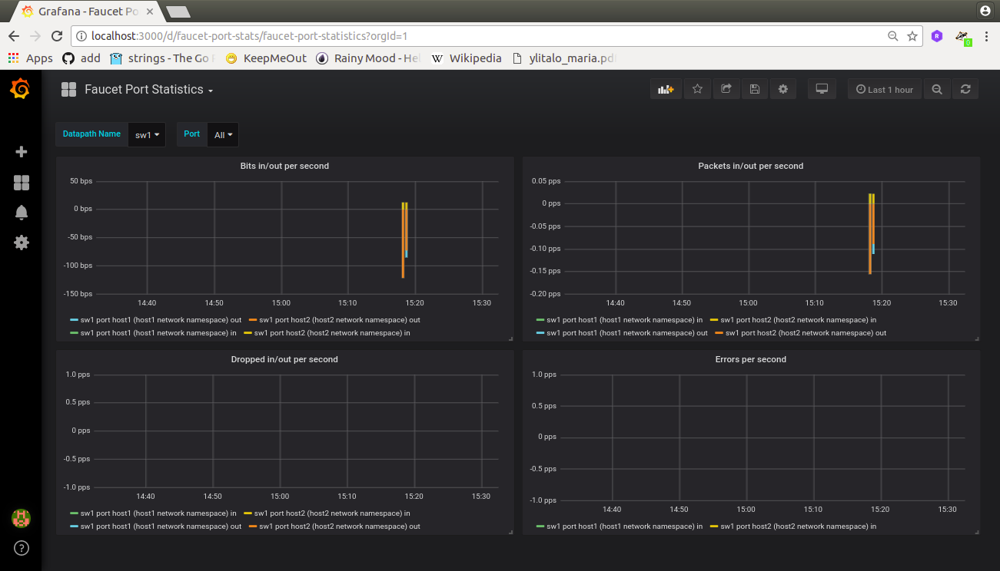

# Experimento por comandos #

1. Crear la topologia


```bash
create_ns () {
    NETNS=$1
    IP=$2
    sudo ip netns add ${NETNS}
    sudo ip link add dev veth-${NETNS} type veth peer name veth0 netns $NETNS
    sudo ip link set dev veth-${NETNS} up
    sudo ip netns exec $NETNS ip link set dev veth0 up
    sudo ip netns exec $NETNS ip addr add dev veth0 $IP
    sudo ip netns exec $NETNS ip link set dev lo up
}

as_ns () {
    NETNS=$1
    shift
    sudo ip netns exec $NETNS $@
}
```

Crear host1 y host2:

```bash
create_ns host1 192.168.0.1/24
create_ns host2 192.168.0.2/24
```

Configurando el switch:

```bash
sudo ovs-vsctl add-br sw1 \
-- set bridge sw1 other-config:datapath-id=0000000000000001 \
-- set bridge sw1 other-config:disable-in-band=true \
-- set bridge sw1 fail_mode=secure \
-- add-port sw1 veth-host1 -- set interface veth-host1 ofport_request=1 \
-- add-port sw1 veth-host2 -- set interface veth-host2 ofport_request=2 \
-- set-controller sw1 tcp:127.0.0.1:6653 tcp:127.0.0.1:6654
```

Posteriormente se verifica las caracteristicas del switch y los host recien creados:

```bash
# Switch
sudo ovs-vsctl show

9ec06414-9bd9-4579-81d4-8e7801c2eb61
    Bridge "br0"
        Controller "tcp:127.0.0.1:6653"
        Controller "tcp:127.0.0.1:6654"
        fail_mode: secure
        Port "veth-host1"
            Interface "veth-host1"
        Port "veth-host2"
            Interface "veth-host2"
        Port "br0"
            Interface "s1"
                type: internal
    ovs_version: "2.5.5"

# Hosts
sudo ip netns list

host2 (id: 1)
host1 (id: 0)

```

**Nota**: Cuando se culmina el experimento con los siguientes comandos se borra la topologia:


```bash
sudo ovs-vsctl del-br s1
sudo ip -all netns delete
```

Si se aplica ping vemos que no hay:

```bash
as_ns host1 ping 192.168.0.2

PING 192.168.0.2 (192.168.0.2) 56(84) bytes of data.
From 192.168.0.1 icmp_seq=1 Destination Host Unreachable
From 192.168.0.1 icmp_seq=2 Destination Host Unreachable
From 192.168.0.1 icmp_seq=3 Destination Host Unreachable
From 192.168.0.1 icmp_seq=4 Destination Host Unreachable
From 192.168.0.1 icmp_seq=5 Destination Host Unreachable
From 192.168.0.1 icmp_seq=6 Destination Host Unreachable
^C
--- 192.168.0.2 ping statistics ---
7 packets transmitted, 0 received, +6 errors, 100% packet loss, time 6150ms
pipe 4

```

**Opcional**: Si se hacen cambios en el archivo de configuracion de prometheus (/etc/faucet/prometheus/prometheus.yml), reiniciar la aplicación:

```bash
sudo systemctl restart prometheus
```

2. Recargar el archivo de configuración del faucet:


A continuacion se muestra el archivo de configuración del faucet:

```yaml
vlans:
    office:
        vid: 100
        description: "office network"

dps:
    sw1:
        dp_id: 0x1
        hardware: "Open vSwitch"
        interfaces:
            1:
                name: "host1"
                description: "host1 network namespace"
                native_vlan: office
            2:
                name: "host2"
                description: "host2 network namespace"
                native_vlan: office
```

El comando para recargar el archivo se muestra a continuación:

```bash
sudo systemctl stop faucet
sudo systemctl disable faucet
sudo systemctl enable faucet
```

3. Arrancar el faucet y el gauge:

```bash
# Arrancando el faucet
sudo faucet -v
# Arrancando el gauge
sudo gauge -v
```

Se puede verificar que ya hay ping:

```bash
as_ns host1 ping 192.168.0.2

PING 192.168.0.2 (192.168.0.2) 56(84) bytes of data.
64 bytes from 192.168.0.2: icmp_seq=1 ttl=64 time=0.499 ms
64 bytes from 192.168.0.2: icmp_seq=2 ttl=64 time=0.070 ms
64 bytes from 192.168.0.2: icmp_seq=3 ttl=64 time=0.098 ms
^C
--- 192.168.0.2 ping statistics ---
3 packets transmitted, 3 received, 0% packet loss, time 2038ms
rtt min/avg/max/mdev = 0.070/0.222/0.499/0.196 ms

```

4. Las siguientes imagenes muestran diferenetes resultados de tomar metricas:

* **Panel de inventario**:



* **Panel de instrumentación**:



* **Panel de estadisticas de puertos**:




## Conclusión ##


