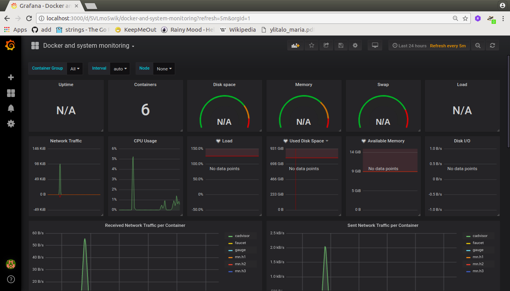

# Experimento con Contenedores #


1. Crear la topologia


```bash
sudo python topologia-test.py 
```

Si se aplica ping vemos que no hay conectividad entre los contenedores:

```bash
containernet> pingall
*** Ping: testing ping reachability
h1 -> X X 
h2 -> X X 
h3 -> X X 
*** Results: 100% dropped (0/6 received)
```

**Opcional**: Si se hacen cambios en el archivo de configuracion de prometheus (/etc/faucet/prometheus/prometheus.yml), reiniciar la aplicación:

```bash
sudo systemctl restart prometheus
```

2. Arrancar el contenedor asociado al faucet:

Teniendo definido el archivo de ciguración de faucet (/etc/faucet/faucet.yml) de acuerdo a la topologia de red tal y como se muestra en el siguiente archivo **faucet.yaml**:

```yaml
vlans:
    test_network:
        vid: 100
        description: "Red de prueba"

dps:
    sw1:
        dp_id: 0x0000000000000001
        hardware: "Open vSwitch"
        interfaces:
            1:
                name: "h1"
                description: "atacante"
                native_vlan: test_network
            2:
                name: "h2"
                description: "cliente"
                native_vlan: test_network
            3:
                name: "h3"
                description: "servidor"
                native_vlan: test_network
```

Ahora arrancando la herramienta:

```bash
# Arrancar el faucet
sudo docker run -d \
    --name faucet \
    --restart=always \
    -v /etc/faucet/:/etc/faucet/ \
    -v /var/log/faucet/:/var/log/faucet/ \
    -p 6653:6653 \
    -p 9302:9302 \
    faucet/faucet
```

3. Arrancar el contenedor asociado al gauge:

```bash
# Arrancar el gauge
sudo docker run -d \
    --name gauge \
    --restart=always \
    -v /etc/faucet/:/etc/faucet/ \
    -v /var/log/faucet/:/var/log/faucet/ \
    -p 6654:6653 \
    -p 9303:9303 \
    faucet/gauge
```

4. Arrancar el contenedor asociado al cAdvisor:

```bash
# Arrancar el cadvisor
sudo docker run \
  --volume=/:/rootfs:ro \
  --volume=/var/run:/var/run:ro \
  --volume=/sys:/sys:ro \
  --volume=/var/lib/docker/:/var/lib/docker:ro \
  --volume=/dev/disk/:/dev/disk:ro \
  --publish=8080:8080 \
  --detach=true \
  --name=cadvisor \
  google/cadvisor:latest
```

5. Verificar la conectividad entre los host de mininet:

```bash
containernet> pingall
*** Ping: testing ping reachability
h1 -> h2 h3 
h2 -> h1 h3 
h3 -> h1 h2 
*** Results: 0% dropped (6/6 received)
```

6. Verificar targets de los que se obtienen las graficas en protetheus:


7. Observar los dasboard con las medidas:

* Panel de cAdvisor:



* Panel de inventario:


* Panel de instrumentación de los controladores:


* Panel con metricas de los puertos:


7. Bajar contenedores cuando culminen las pruebas:

```bash
sudo docker stop gauge
sudo docker stop faucet
sudo docker stop cadvisor
sudo docker rm cadvisor
sudo docker rm gauge
sudo docker rm faucet
```

## Algunas metricas ##

En el siguiente [enlace](https://docs.faucet.nz/en/latest/monitoring.html) se muestran algunas de las metricas:
1. Exportadas por gauge:
   * of_port_tx_bytes
   * of_port_rx_bytes
   * of_port_rx_packets
   * of_port_tx_packets
   * of_port_rx_dropped
   * of_port_tx_dropped
   * of_errors_total
2. Exportadas por faucet:
   * faucet_packet_in_secs
   * learned_macs
   * port_status
   * dp_status
   * of_dp_desc_stats
   * of_ignored_packet_ins_total
   * of_packet_ins_total
   * of_flowmsgs_sent_total

## Conclusión ##
El error que se esta intentando evitar aun permanece. Se va a intentar trabajar en un ambiente virtual.

